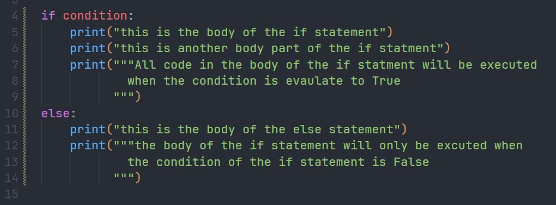
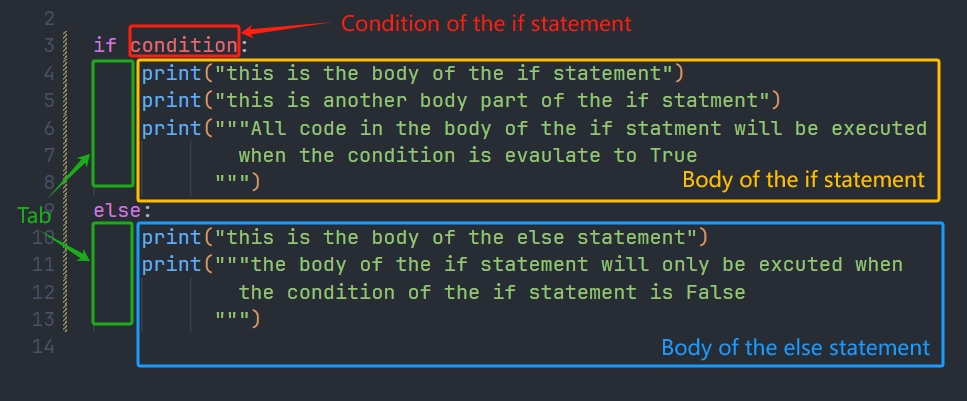

# Flow Control

### The if statement



The ```if``` statement can be used to control of the flow of the execution based on it's condition. Here is the anaotomy of the ```if``` statement:



The ```condition``` of the if statement must be an ```expression``` that evaluates to ```True``` or ```False```.

The lines after the ```if condition:``` and has a ```indentation```(tab) before them are called the body of the if statement.

The body of the if statement will only be executed when the ```condition``` of the if statment is True. 

you can optionally add an ```else``` statement after the body of the if statement. The body of the ```else``` statement will only be executed when the ```condition``` of the if statement is False.

in addtion, you can also add an ```elif condition:```
```py
if condition:
    print("only called when conditon is True")
elif condition2:
    print("only called if condition is False and condition2 is True")
else:
    print("only called when both condition and condition2 are False")
```

### The For Loop

for loop allows you to repeat a block of code mutliple times, there are two types of for loops:

* Range Based For Loop:
```py
for i in range(0, 10):
    print("this is part of the body of the for loop")
    print(i)
```
this will out put:
```sh
> this is part of the body of the for loop
> 0
> this is part of the body of the for loop
> 1
> this is part of the body of the for loop
> 2
> this is part of the body of the for loop
> 3
> this is part of the body of the for loop
> 4
> this is part of the body of the for loop
> 5
> this is part of the body of the for loop
> 6
> this is part of the body of the for loop
> 7
> this is part of the body of the for loop
> 8
> this is part of the body of the for loop
> 9
```
The range is inclusive on the left, and exclusive on the right, so the range of ```range(0, 10)``` is 0 - 9, not including 10. 

In the above example, the body of the ```for``` loop will keep on repeating, the firt time, the value of ```i``` is 0, the second time, it's value becomes 1, everytime the for loop repeats, the value of ```i``` increment by 1. The ```for``` loop will keep on repeating until the value of ```i``` is no longer in the range of 0 - 9.

Notice that the full form of the ```range(0, 10)``` should be ```range(0, 10, 1)```, the last parameter is how the value of ```i``` increments at the end of each for loop. 

the 3 argument is the ```range(0, 10, 1)``` is called ```start```, ```stop```, ```step```. the value of ```i``` starts from 0, stops at 10 (not including 10), and each time the for loop repeats, i = i + 1(step).

if the code changes to:
```py
for i in range(0, 10, 2):
    print(i)
```
then the out put will be:
```sh
> 0
> 2
> 4
> 6
> 8
```

if you want to go backwards from 9 to 0, then the code should be:
```py
for i in range(9, -1, -1):
    print(i)
```
this will output:
```sh
> 9
> 8
> 7
> 6
> 5
> 4
> 3
> 2
> 1
> 0
```
* The ```foreach``` loop.

The ```foreach``` loop is used to loop through each element in a container

to loop through each element of a ```list``` or ```tuple```:

```py
names = ["Allen", "Gregory", "Nick"]

for item in names:
    print(item)
```
the output will be:
```sh
> Allen
> Gregory
> Nick
```
if you also what to have the index:
```py
for i, item in enumerate(names):
    print(f"item: {item} at index: {i}")
```
the output will be:
```sh
> item: Allen at index: 0
> item: Gregory at index: 1
> item: Nick at index: 2
```
To loop through a ```dictionary```:
```py
studentInfo = {"name":"Gregory", "age":21, "level":"senior"} 
for key, value in studentInfo.items():
    print(f"{key}:{value}")
```
the output will be:
```sh
> name : gregory
> age : 21
> level : senior
```

### The While Loop

The ```while``` loop is a loop that repeats it's body as long as it's condition is True

```py
while condition:
    print("this repeats as long as condition is True")
```
for example, we can mimic the same effect as the ```for i in range(0, 10):``` loop above by simply doing:
```py
i = 0
while i < 10:
    print(i)
    i=i+1
```
the output will be:
```sh
> 0
> 1
> 2
> 3
> 4
> 5
> 6
> 7
> 8
> 9
```
```while``` loop is used when you want to keep repeating until a condition has changed. In this case then it's not clear how many repeatitions are needed.

### Flow Control Keyword
* ```break```

Sometimes the loop needs to terminate earlier, for example, if we have a list names:
```py
names = ["Allen", "Gregory", "Carolina"]
```
if we want to find out if Gregory is in the list, we can do
```py
for name in names:
    if name == "Gregory": 
        print("Found!")
    else:
        print("Keeps looking!")
```
The output is:
```sh
Keeps looking!
Found!
Keeps looking!
```
Since the second loop already found Gregory, there is really no need to go through the rest of the loop. We can add the ```break``` keyword anywhere in the loop to terminate it: 


```py
for name in names:
    if name == "Gregory": 
        print("Found!")
        break # break added here, terminate the for loop right away
    else:
        print("Keeps looking!")
```

The output is:
```sh
Keeps looking!
Found!
```
* ```continue```

The continue keyword is used to in a loop to skip to the next repeatation of the loop, say we want to print number from 0 - 9, but not including 5:
```sh
for i in range(0, 10):
    if i == 5:
        continue # continue to the next loop right away
    print(i)
```
The output is:
```sh
> 0
> 1
> 2
> 3
> 4
> 6
> 7
> 8
> 9
```
