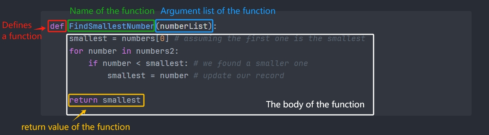

# Functions

Functions allows you to run a block reuseable code by calling it.
For example, we want to find the smallest number in a list:
```py
numbers = [1, 3, 5, -1, -8, 10, -2]
```
We can use a for loop to go through the list, and keep on updating a smallest record:
```py
smallest = numbers[0] # assuming the first one is the smallest
for number in numbers:
    if number < smallest: # we found a smaller one
        smallest = number # update our record
print(f"the smallest is: {smallest}")
```
the output will be:
```sh
the smallest is: -8
```

say we what to use it for another list of numbers, without functions, we will have to write the same for loop again:
```py
numbers2 = [3, 1, 8, 12, -5, -3, 10]

smallest = numbers[0] # assuming the first one is the smallest
for number in numbers2:
    if number < smallest: # we found a smaller one
        smallest = number # update our record
print(f"the smallest is: {smallest}")
```
This is code duplication, something to be avoided if possible, to do so, we can put all the code we are duplication into a function: 
```py
def FindSmallestNumber(numberList):
    smallest = numbers[0] # assuming the first one is the smallest
    for number in numbers2:
        if number < smallest: # we found a smaller one
            smallest = number # update our record

    return smallest
```
The function is defined by starting with the ```def``` keyword, follow by the ```name``` of the function, and then the ```argument list``` of the function, and then a ```:```. Any indented lines after the ```:``` are the body of the function. a function can also ```return``` a value if needed: 


The body of the function will not be executed unless the function is called, to call a function. type it's name followed by the argument list, for example, if we want to get the smallest number in ```numbers1```, we can do so by calling the ```FindSmallestNumber``` function we created above and put ```numbers1``` as the argument:
```py
smallest1 = FindSmallestNumber(numbers1) # the value of smallest1 will be -8
```
When we call a function, the flow of the program jumps to the first line of the body of the function, and start executing the code there. The variables in the argument list is then assigned with the values/variables put into the argument. When all the code is finished, the flow of the program jumps out of the function, and start running the code after the function call.

If the function returns a value, then we can take that return value and assign it to an outside variable(smallest1), or we can use it in any other expresions.

Now to print out the smallest numbers in both ```numbers1``` and ```numbers2```, we can just do:

```py
print(FindSmallestNumber(numbers1))
print(FindSmallestNumber(numbers2))
```
* Multiple Arguments

A function can take more than one argument, the are defined in the argument list sperated by ```,```
```py
def AddTwoNumbers(a, b):
    return a + b
```
we can call the function by typing in it's name and the values of the arugments speperated by ```,```
```py
print(AddTwoNumbers(1, 2)) # prints out 3
```

* The ```return``` keyword

whenever a ```return``` is executed within a function, the function will temimate and the flow jumps out right away, for example, if we want to create a function that tells us if an item is in a given list:
```py
def Contains(listToCheck, itemToLookFor):
    for item in listToCheck:
        if itemToLookFor == item:
            return True # we found it! no need to continue, return True right away!
        
    return False # we never found one, should return False
```
the return before the end of the function is called ```early return```

if no values needs to be returned, ```return``` is not required, if an ```early return``` is needed, a simple ```return``` will surfice:

```py
def PrintList(listToPrint):
    if len(listToPrint) == 0:
        print("Warning, list is empty!!")
        return

    for item in listToPrint:
        print(item)
    # return is not required here
```

* Variadic Argument

We can make a function to take in any amount of variables:
```py
def PrintAll(*args):
    for item in args:
        print(item)
```
the ```*args``` means it can take in any amount of arbitrary arguments, and in the function, the ```args``` variable will just be a list that contains all the argument you put in. so we can do:
```py
PrintAll(1, 2, 3, "Steve", 4)
```
the output will be:
```sh
> 1
> 2
> 3
> Steve
> 4
```

* Keyword Arguments

We can also make a function to take in arguments as key value pairs:

```py
def SayHelloTo(**kwargs):
    print(f"hello {kwargs["firstName"]} {kwargs["lastName"]}")
```
The ```**kwargs``` means we are expecting key value pairs in the argument list, and the ```kwargs``` variable within the function will just become a dictionary that is composed of the key value pairs you put in, to call a function with ```**kwargs```:
```py
SayHelloTo(firstName = "Amanda", lastName = "Jones")
```
in this case, the ```kwargs``` variale in the ```SayHello``` function will become:
```py
{"firstName":"Amanda", "lastName":"Jones"}
```
and the output of the function call will be:
```sh
> hello Amanda Jones
```
